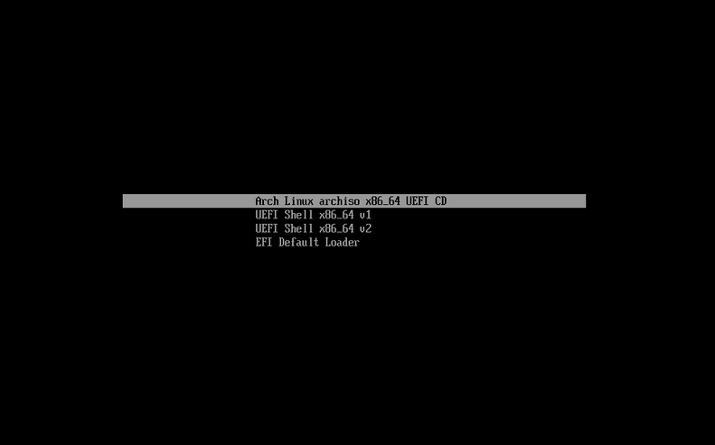

# Arch-Install

An ansible automation for installing and configuring Arch Linux.

After running a minimal Arch Linux installation bash script, the playbook uses my dotfiles git repo to configure Arch.

In other words, I download the [newest arch linux image](https://archlinux.org/download/), [prepare an installation medium in any way](https://wiki.archlinux.org/title/USB_flash_installation_medium), and then install it from the following state:


To this:


## Usage

First, please read through this guide before running any commands!
Second, please view arch_install_part1.sh, arch_install_part2.sh, the playbook and roles and modify them to your personal liking (I write how to get the repo files on the archiso tty in this README).

After you are sure about the scripts you are about to install, insert the Arch Linux installation medium, and enter the installation menu, choose the first option (the option that contains the "archiso", and "UEFI"). After around 30 seconds, you will get the archiso shell prompt (the interactive control), and then run the following steps:

1. `curl -LOJ https://github.com/omersch381/arch-linux-install-ansible/archive/master.zip`
Or
1. `curl -LOJ https://shorturl.at/cgwHQ` - which shortens the above link [give it a shot](https://shorturl.at/cgwHQ).
2. `bsdtar xvf arch-linux-install-ansible-main.zip`
3. `cd arch-linux-install-ansible-main`
4. `chmod u+x arch_install_part1.sh`
5. `./arch_install_part1.sh`

The first script will install everything which is normally installed until the arch-chroot part.
The second script will be run by the first one from the /mnt directory.
At some point the installation script will ask you for a root password.
You should see 'Setup Complete!', and 'type "reboot" and remove installation media'. Reboot the machine.

Log in as root, and run the following steps:
1. `cd arch-linux-install-ansible-main`
2. `pacman -S ansible`

Create 1 file in the repo:
`touch host_vars/localhost/passwords`
`vim host_vars/localhost/passwords`

Make sure you have 2 variables: non_root_password, github_token.
non_root_password will be the non root (user's) password.
github_token will be your github_token. [For more information, please click here](https://docs.github.com/en/authentication/keeping-your-account-and-data-secure/creating-a-personal-access-token)

An example to that file could be:
`````````````````````````````````````````
---
non_root_password: '$upEr_$EcrEt'
github_token: my-github-token
`````````````````````````````````````````

Note: DO NOT SKIP THE SINGLE QUOTE (') ON 1!
Note: You can encrypt the file using [ansible-vault](https://docs.ansible.com/ansible/latest/user_guide/vault.html)

Anyway, the .gitignore will ignore any file which contains the string 'pass'.


Now run:
`ansible-playbook site.yml`
Or in case you encrypted the passwords file, you could run:
`ansible-playbook site.yml --ask-vault-password`

And that's it! Reboot the machine when the playbook finishes.